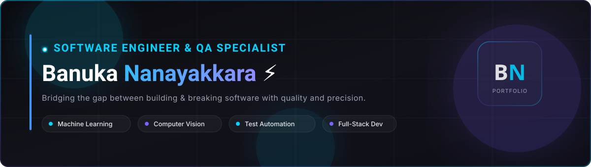

<div align="center">

<!-- Custom Designed Portfolio Header Banner -->


<br/>

<!-- Quick Action Badges -->
[](https://github.com/BanukaMandinu)
[](https://www.linkedin.com/in/banuka-nanayakkara/)
[](https://wa.me/94766221125)
[](mailto:banukananayak@gmail.com)

</div>

---

### 💫 About Me

```yaml
Name: Banuka Nanayakkara
Role: Associate QA Engineer @ AtLink Communications Inc.
Education: BEng (Hons) Software Engineering @ University of Westminster
Focus Areas: Test Automation • Computer Vision • GANs & Diffusion Models • AI Testing
Core Philosophy: "Bridging the gap between building resilient software & breaking it to ensure perfection."
```

- 🏢 **Associate QA Engineer** at **AtLink Communications Inc.** with **2+ years** of industry experience in automated and manual testing.
- 🧪 Hands-on expertise in **Playwright**, **Selenium**, **Playwright Codegen**, **MCP Servers**, **API Testing**, and **Accessibility Validation**.
- 🤖 Passionate about AI-driven ecosystems with deep knowledge in **Computer Vision**, **GANs**, **Diffusion Models**, and **Machine Learning Model Training**.
- 🛠️ Experienced in building multi-threaded concurrent systems, scalable web applications, and high-coverage test pipelines in **Python** and **Java**.

---

### 🛠️ Tech Stack & Proficiencies

<div align="center">

#### 🧪 Test Automation & QA


#### 🤖 AI, ML & Computer Vision


#### 💻 Programming & Concurrency


#### 🗄️ Databases & Cloud


#### 🌐 Web & Development


#### 🛠️ Tools & Workflow


</div>

---

### 💼 Work Experience

| Role & Company | Type & Timeline | Core Technologies & Responsibilities |
| :--- | :--- | :--- |
| **Associate Quality Assurance Engineer**<br/><sub>AtLink Communications Inc.</sub> | Full-time &bull; Hybrid<br/>`Sep 2025 — Present` | &bull; Driving test automation frameworks and manual quality verification.<br/>&bull; Hands-on testing with Playwright, Playwright Codegen, and MCP servers.<br/>&bull; Leading API test validations, accessibility testing, and end-to-end regression pipelines. |
| **Quality Assurance Intern**<br/><sub>AtLink Communications Inc.</sub> | Internship &bull; Hybrid<br/>`Jul 2024 — Jun 2025` *(1 yr)* | &bull; Engineered automated test suites using Selenium with Java and Python.<br/>&bull; Executed regression testing, authored comprehensive test cases, and identified bugs.<br/>&bull; Collaborated actively within fast-paced Agile/Scrum sprint cycles. |

---

### 🚀 Featured Projects

| Project | Description | Tech Stack | Repository |
| :--- | :--- | :--- | :--- |
| **🧠 SketchMRI** | Deep learning medical imaging synthesizing & reconstructing brain MRI scans from sketches using GANs & Diffusion Models. | `Python` `PyTorch` `GANs` `Diffusion Models` `CV` | [**View Repo**](https://github.com/BanukaMandinu/SketchMRI) |
| **🔊 Phone Brr** | Innovative platform revolutionizing video experiences by delivering haptic sensations through sound frequencies. | `JavaScript` `Web Audio API` `Haptics` `HTML/CSS` | [**View Repo**](https://github.com/BanukaMandinu/Phone-Brr) |
| **⚡ Concurrent Simulator** | High-throughput transaction & ticket booking simulation using thread pools, mutex locks, and synchronization. | `Java` `Multi-threading` `Concurrency` `Locks` | [**View Repo**](https://github.com/BanukaMandinu/ConcurrentProgramming_Scenario_2) |
| **⚙️ Concurrency Suite** | Multi-threaded concurrent systems solving race conditions, deadlock prevention, and thread-safe scheduling. | `Java` `Thread Safety` `Deadlock Prevention` | [**View Repo**](https://github.com/BanukaMandinu/Concurrent-Programming) |
| **🎬 Cinema Booking** | Interactive cinema seat reservation system with dynamic seating matrices, seat tier pricing, and automated receipts. | `Java` `OOP` `Data Structures` `System Design` | [**View Repo**](https://github.com/BanukaMandinu/Cinema-Booking-system) |
| **🏛️ Sri Lankan Tradition** | Immersive cultural web platform celebrating Sri Lankan cultural heritage, folk arts, and historic architecture. | `HTML5` `CSS3` `JavaScript` `Responsive` | [**View Repo**](https://github.com/BanukaMandinu/website-for-sri-lankan-tradition-) |
| **🛒 Shopping Cart Manager** | Object-oriented inventory & cart management desktop application with stock tracking and itemized invoicing. | `Java` `Swing GUI` `OOP` `Inventory System` | [**View Repo**](https://github.com/BanukaMandinu/Shoppingcart-Manager) |
| **📊 Credit Calculator** | Financial modeling application computing loan amortization schedules, interest breakdown, and custom repayments. | `Python` `Financial Algorithms` `Modeling` | [**View Repo**](https://github.com/BanukaMandinu/credit-calculator) |

---

### 🎓 Education

| Institution | Degree / Program | Duration | Key Focus Areas |
| :--- | :--- | :--- | :--- |
| **🏛️ University of Westminster** | **BEng (Hons) in Software Engineering** | `Sep 2022 — Sep 2026` | Machine Learning, Model Training, Computer Vision, Concurrent Programming, Software Architecture, Web Tech |
| **🎓 Informatics Institute of Technology (IIT)** | **Foundation in Higher Education (CS)** | `Sep 2021 — Sep 2022` | Python Programming, Relational Databases (MySQL), OOP Foundations, Data Modeling |
| **🏫 Maris Stella College Negombo** | **Physical Sciences (Advanced Level)** | `2017 — 2020` | Mathematics, Physics, Analytical Problem Solving |

---

### 📊 GitHub Analytics

<div align="center">


<br/><br/>


</div>

---

<div align="center">

### 📬 Connect With Me

[](https://wa.me/94766221125)
[](https://www.linkedin.com/in/banuka-nanayakkara/)
[](mailto:banukananayak@gmail.com)
[](https://github.com/BanukaMandinu)

<br/>


<br/>

<sub>⚡ Built to match the aesthetic of [Banuka's Portfolio](https://github.com/BanukaMandinu)</sub>

</div>
